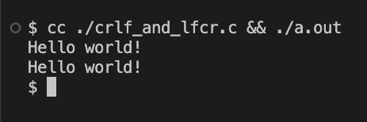

줄바꿈문자로 보통 윈도우는 `\r\n`을, POSIX류는 `\n`을 사용한다.
~나는 운영체제 상관 없이 `\n`을 사용하지만.~

`\r\n`과 `\n`은 무슨 뜻이고 차이는 뭘까? 그리고 왜 `\n\r`은 안 쓸까?

## 목차 \{#TOC\}

[TOC]

## 각각의 뜻 \{#meaning-of-each\}

`\r`은 캐리지 리턴(CR, **C**arrage **R**eturn)이고, `\n`이 진짜 줄바꿈문자(LF, **L**ine **F**eed)이다.

재미도 감동도 없는 역사 얘기는 빼고, 유의미한 정보만을 전달하자면 대충 이 정도 되겠다.

- `\r`(Carrage Return): 커서를 그 줄의 맨 앞으로 옮긴다
- `\n`(Line Feed): 커서를 아래로 한 칸 내린다

대충 이런 의미지만 보통은 그냥 줄바꿈문자로 쓰인다.

그런데 정말 그 뜻 그대로 쓰이는 곳이 있다. 바로 CLI 환경이다.

## 예시 \{#examples\}

예시로 뭐가 어떻게 다른지 확인해보자.

### 줄바꿈 없을 때 \{#none\}

```c file=./embed/none.c {4}
```

줄바꿈문자를 출력하지 않았을 때의 출력 결과는 아래 스크린샷과 같다. (sh 기준)


프로그램 실행이 끝나고 `$ `가 출력된 것이다.[^1]

[^1]: 쉘을 `PS1='$ ' sh`로 실행했음

### CR \{#cr\}

```c file=./embed/cr.c {4}
```

이 코드를 실행해보면 아래 스크린샷처럼, 커서가 그 줄의 맨 앞으로 이동된 것을 확인할 수 있다.


마찬가지로 프로그램 실행이 끝나고 `$ `가 출력된 것인데,
커서가 맨 앞으로 이동돼 있었기 때문에 `He`부분이 가려져서 `llo world!`가 보이는 것이다.

### LF \{#lf\}

```c file=./embed/lf_incomplete.c {4}
```


뭔가... 이상하다?
커서가 아래로 한 칸 내려가기만 한 게 아니라 `\r`을 붙인 것 같은 결과가 나오고 있다.

이는 터미널의 모드 때문이다. 기본적으로는 canonical mode로, 자동으로 이것저것 처리된다.

raw mode로 들어가면 자동으로 이것저것 처리되던 것들이 꺼진다.
일단 출력 후처리만 끄고 해 보자.

```c file=./embed/lf_complete.c {9-10}
```


기대대로 나오는 것을 확인할 수 있다!

### CRLF, LFCR \{#crlf-and-lfcr\}

```c file=./embed/crlf_and_lfcr.c {9,10,12}
```



CRLF나 LFCR이나 똑같아보인다. 그럼 왜 CRLF는 쓰고 LFCR은 안 쓰는 걸까?

그 이유는 바로 stdout의 버퍼링에 있다. 자세한 내용은 `setvbuf` 참조.

```c file=./embed/crlf_and_lfcr_and_sleep.c {9,11,12,14,15,17}
```


일단 결과는 같다.


CRLF 이후에 sleep중인 모습. 예상과 같다.


LFCR 이후에 sleep중인 모습.
stdout이 줄 단위로 버퍼링되기 때문에 `\r`이 아직 출력되지 않은 상태.

## 결론

stdout의 라인 버퍼링 때문에 `\n\r`은 `\r`이 늦게 출력될 수 있으므로 `\r\n`을 쓴다.
